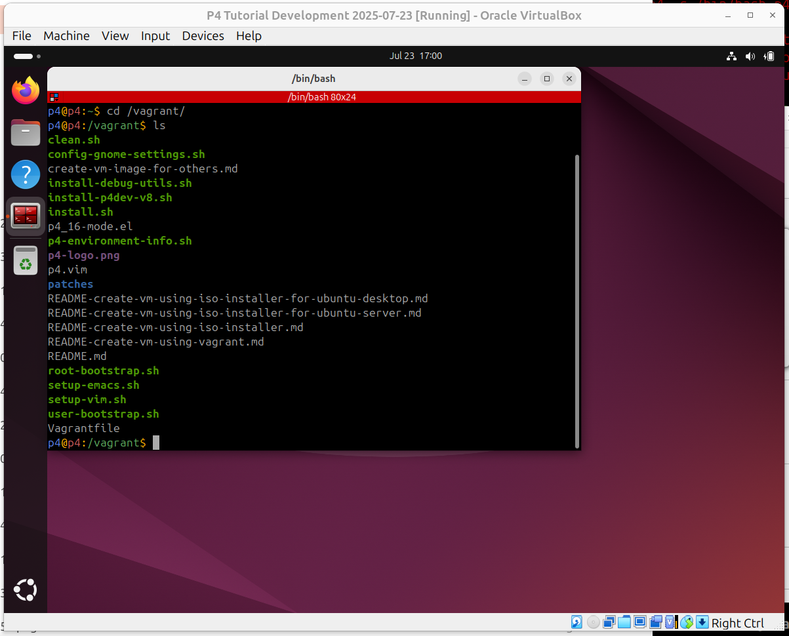

# Vagrant and Virtual Box VM Setup

Follow the instructions in the official [README.md](../README.md)
which suggests installing vagrant and virtual box.  The basic instructions are:

[Install Vagrant](https://developer.hashicorp.com/vagrant/install)
(note you have to manually copy and execute each line for their Ubuntu 24.04 commands...)

[Install Virtualbox](https://www.virtualbox.org/wiki/Linux_Downloads)
(download *.deb file and run... at time of wiritng I installed Virtualbox 7.1)

## Enable syncing of P4 tutorials repo into the Ubuntu 24.04 VM

In the Vagrant [file](./../vm-ubuntu-24.04/Vagrantfile) enable the syncing of the root of the P4 tutorials repo into the VM, by changing this line as follows:
~~~
config.vm.synced_folder '.', '/vagrant', disabled: true
~~~
to: 
~~~
config.vm.synced_folder './..', '/vagrant', disabled: true
~~~

This mounts the repo into the `/vagrant/` directory inside the VM.

## Use Vagrant to spin up the VM

In the [Ubuntu 24.04 VM](./../vm-ubuntu-24.04/) directory, run in the terminal:
~~~
$ vagrant up --provision
~~~
Now you must WAIT! It takes some time before everything is set up and installed. If you try to login before it's all done, one will not be able to using the 'p4' user.

Note that the `--provision` flag runs the commands in [root-bootstrap.sh](../vm-ubuntu-24.04/root-bootstrap.sh) which technically only needs to be run once, and Vagrant does run it the first time the VM is created.  However, you may find it 'safer' to run the VM with this flag even after the first spin up.

## Possible AMD-V error

If you get an error like:

~~~
==> release: Booting VM...
There was an error while executing `VBoxManage`, a CLI used by Vagrant
for controlling VirtualBox. The command and stderr is shown below.

Command: ["startvm", "75070036-35da-4f7c-8d81-12458ead236c", "--type", "gui"]

Stderr: VBoxManage: error: AMD-V is disabled in the BIOS (or by the host OS) (VERR_SVM_DISABLED)
VBoxManage: error: Details: code NS_ERROR_FAILURE (0x80004005), component ConsoleWrap, interface IConsole
~~~

Then Virtualbox requires AMD-V enables so make sure you enable it in BIOS:

~~~
[BIOS splash screen] -> [press F2] -> [MIT settings] ->
[Frequency Settings] -> [CPU Settings] -> [SVM Mode] -> Enable
~~~

## Logging into the Ubuntu VM

The guest OS GUI should appear at the end.  Login with:

~~~
User: p4
PW: p4
~~~

If you try to edit the files from within the guest VM, you get 'Permission denied'.  So do the file editing on the host machine, and run the binaries/commands in the guest VM.

